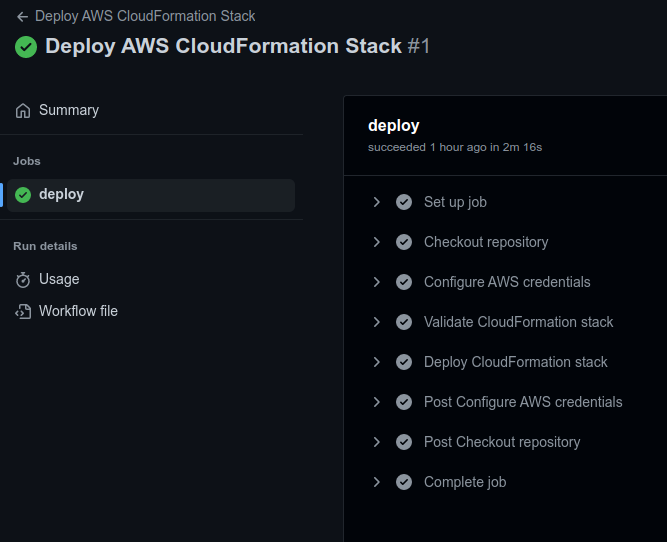
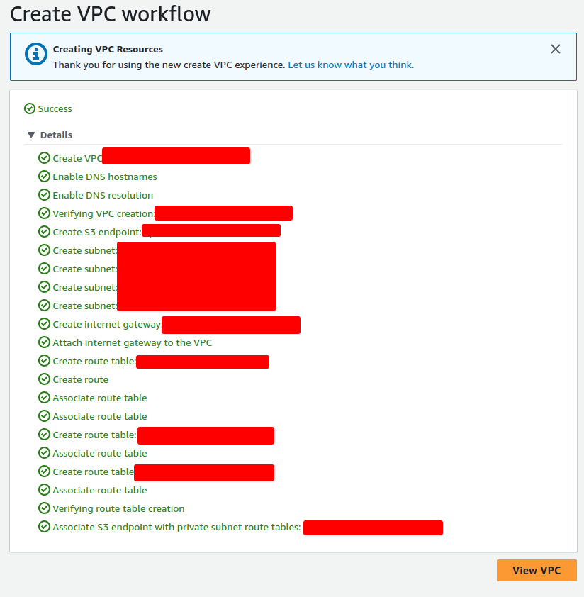

# AWS CloudFormation, Ansible, and GitHub Actions Project
This project demonstrates how to use AWS CloudFormation and GitHub Actions to deploy a multiple service AWS Cloud, with the following components:
- Amazon Elastic File System (EFS)
- Amazon Relational Database Service (RDS)
- Amazon Elastic Compute Cloud (EC2)
- Elastic Load Balancer (ELB)

After the CloudFormation Stacks are deployed, another GitHub Actions is use for deploying a WordPress site inside EC2 instances that are created by CloudFormation using Ansible.

# Architecture
The following diagram shows the architecture of the AWS Cloud deployment:


## Prerequisites

Before you start the deployment, you need to have the following prerequisites:
- An AWS account with permissions to create and manage the required AWS services.
- An Amazon EC2 key pair for SSH access to the EC2 instances.
- An Amazon EC2 Bastion Host with SSH Access allowed to GitHub Address Ranged


# Repository Structure
This repository contains files and directories for deploying AWS Stacks using CloudFormation and deploying a WordPress site inside EC2 instances that are created by CloudFormation using Ansible.

```
repository
├── ansible
│   ├── ansible.cfg
│   ├── inventory.ini
│   ├── wordpress.yml
│   └── wp-configs.php.j2
├── cloudformation
│   └── cloudformation.yml
├── github
│   └── workflows
│       └── cloudformation.yml
│       └── ansible.yml
└── README.md

```

## Cloudformation Folder
The cloudformation directory contains the CloudFormation template file for creating the EC2 instances on which the WordPress site will run. Here's what the file does:

- `cloudformation.yml`: This is the CloudFormation template file that creates the EC2 instances and associated resources needed to run the WordPress site. It also launches a user data script on the instances that installs Ansible and runs the wordpress.yml playbook to configure the WordPress site.

## Ansible folder
The ansible directory contains Ansible playbooks and configuration files for configuring the WordPress site on the EC2 instances that are created by CloudFormation. Here's what each file does:

- `ansible.cfg`: This is the Ansible configuration file that specifies various settings such as the location of inventory and roles directories.
- `inventory.ini`: This is the Ansible inventory file that specifies the hosts on which Ansible should run the playbooks.
- `wordpress.yml`: This is the Ansible playbook that configures the WordPress site on the EC2 instances.
- `wp-configs.php.j2`: This is the Jinja2 template file for the wp-config.php file, which is used to configure the WordPress site's database connection settings.

## github/workflows Forder
The .github/workflows directory contains GitHub Actions workflows for automatically deploying the AWS Stack and the WordPress site whenever a commit is made to the repository. Here's what each file does:

- `ansible.yml`: This is the GitHub Actions workflow file that runs the wordpress.yml Ansible playbook on the EC2 instances after they are created by CloudFormation.

- `cloudformation.yml`: This is the GitHub Actions workflow file that creates the AWS Stack using the cloudformation.yml template file whenever a commit is made to the main branch. 

## ansible-docker Folder
This folder is used to dockerize the Ansible repository to builds an image containing the necessary components for running the playbook, including Ansible, the AWS CLI, and any other dependencies required by the playbook. 

## wp-cli-docker Folder
This folder is used to create a docker image containing a wordpress automated posting scripts that run every hour.

# Result
## This is the result of the GitHub Workflows


## This is the result of Cloud Formation


